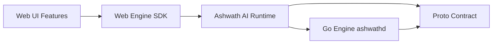
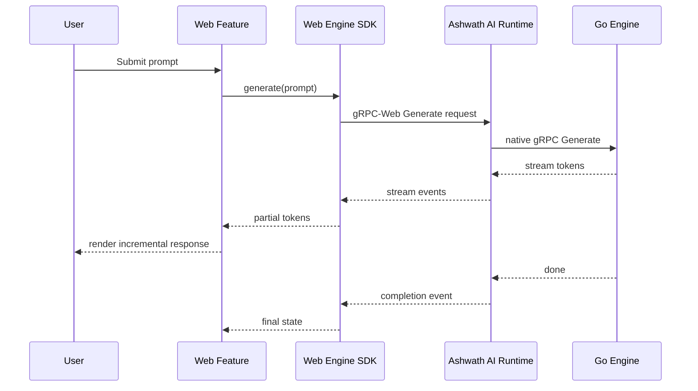

# Sprint W3A – Engine Integration Architecture

Status: Draft

---

## Purpose

This document defines the architecture required to connect the Web Client to the Go Engine for real inference, session management, and model operations. It is intentionally architecture-focused and does not introduce production implementation changes.

The design is grounded in the existing contract in [docs/ENGINE_CLIENT_CONTRACT.md](ENGINE_CLIENT_CONTRACT.md), the engine API in [docs/ENGINE_API.md](ENGINE_API.md), the current web structure in [docs/WEB_ARCHITECTURE.md](WEB_ARCHITECTURE.md), and the existing gRPC service definition in [engine/api/proto/service.proto](../engine/api/proto/service.proto).

---

## Architectural Goals

- Keep the Go Engine as the single source of truth.
- Keep the Web Client thin and presentation-oriented.
- Reuse the existing protobuf-based gRPC contract wherever possible.
- Support streaming generation from the browser without introducing business logic into UI code.
- Preserve local-first behavior and avoid remote-cloud dependency.
- Make the integration testable, observable, and evolvable.

---

## Platform Runtime Principle

Every Ashwath AI client is a standalone local application. This includes the Android Client, Web Client, Desktop Client, CLI, and future clients. Each client follows the same platform architecture: a client application rendered by its native platform experience, connected to a local Ashwath AI Runtime that runs on the same machine.

Every client communicates only with its own local Ashwath AI Runtime. The Runtime is a core platform component, not merely a transport layer. It owns engine lifecycle, the local API server, engine discovery, health monitoring, model management, knowledge services, configuration, telemetry, and updates. The Runtime embeds and manages the Go Engine and is the only component responsible for communicating with the Go Engine.

Clients never communicate directly with the Go Engine, and clients never communicate with each other. The Runtime preserves the Engine-First architecture regardless of client technology, while the protobuf contract remains the single source of truth for all engine-facing communication.

---

## Core Architectural Decision

The Web Client will not talk to the Go Engine directly as a browser-native process. Instead, the architecture introduces the Ashwath AI Runtime as a first-class local platform component that runs on the user’s machine and owns engine discovery, process lifecycle, local API serving, health monitoring, model management, configuration, telemetry, and updates.

This decision is preferred because the browser cannot directly launch or manage the engine binary. The Runtime keeps the web experience local-first while preserving the existing gRPC contract.

### Why this was chosen

- It matches the current platform architecture and the existing Go engine boundary.
- It allows the Web Client to remain a browser app while still using the same engine API as Android.
- It keeps platform responsibilities behind a dedicated local boundary instead of leaking them into feature code.

### Alternatives considered

- Direct gRPC-Web to the Go Engine from the browser.
  - Pros: Simplest transport model.
  - Cons: The browser cannot launch the engine process, so lifecycle and discovery become awkward and non-portable.
- A desktop wrapper such as Tauri or Electron hosting both the web UI and the engine.
  - Pros: Strong local integration and simpler process control.
  - Cons: It changes the runtime model and expands scope beyond the current web-only architecture.
- A JSON/HTTP adapter without protobuf.
  - Pros: Easy browser integration.
  - Cons: It diverges from the existing engine contract and weakens cross-platform consistency.

### Trade-offs

- The Runtime adds a first-class platform component, but it provides clear ownership of engine lifecycle, discovery, and local service responsibilities.
- The architecture is slightly more complex than a pure browser-only implementation, but it remains compatible with the established engine API.

---

## 1. Runtime Communication Layer

### Decision

Use the Ashwath AI Runtime plus gRPC-Web for browser-to-runtime communication, and native gRPC from the Runtime to the Go Engine.

### Why this was chosen

- The existing engine contract is already protobuf-based and gRPC-native.
- The browser can consume gRPC-Web traffic over localhost without changing the business contract.
- The Runtime can translate browser requests to the engine without forcing the browser to understand engine process management or local platform responsibilities.

### Proposed flow

1. The Web Client calls a typed SDK interface.
2. The SDK sends requests to the Runtime over gRPC-Web.
3. The Runtime forwards the request to the Go Engine over native gRPC.
4. Responses and streams are returned to the Web Client through the same boundary.

### Alternatives considered

- Plain HTTP/JSON.
  - Pros: Simplest browser path.
  - Cons: Not aligned with the protobuf contract and would require a parallel API surface.
- WebSockets.
  - Pros: Natural for streaming.
  - Cons: Adds a second transport pattern and diverges from the existing engine contract.
- Direct native gRPC from a desktop wrapper.
  - Pros: Lowest friction for desktop.
  - Cons: Not suitable for a browser-only deployment model.

### Trade-offs

- gRPC-Web introduces more ceremony than REST, but it preserves schema-driven communication and streaming semantics.
- The Runtime adds orchestration overhead, but it isolates the browser from platform-level runtime concerns.

---

## 2. Streaming Architecture

### Decision

Use server-streaming RPCs for generation and model-progress events, with a dedicated stream adapter in the web SDK.

### Why this was chosen

- The current engine contract already exposes a streaming `Generate` RPC.
- Streaming is the correct fit for token-by-token generation and progressive UI updates.
- The UI can render partial output without waiting for the full completion payload.

### Proposed model

- The Runtime forwards the gRPC stream to the Web Client as an event stream.
- The Web SDK exposes typed events such as `token`, `delta`, `done`, `error`, and `cancel`.
- Feature state stores consume these events and update the conversation UI.

### Alternatives considered

- Polling the engine for progress.
  - Pros: Simpler to reason about.
  - Cons: High latency and poor UX for token streaming.
- Using a single long-lived WebSocket channel for all traffic.
  - Pros: Simple event model.
  - Cons: It diverges from the existing generated RPC contract and complicates multiplexing.

### Trade-offs

- Streaming offers a smoother experience, but it requires explicit handling for cancellation, interruption, and re-connection.

---

## 3. Engine Discovery

### Decision

The Runtime owns engine discovery. The Web Client never discovers the engine binary directly.

### Why this was chosen

- Browser code should not be responsible for machine-local binary lookup.
- The Runtime is the correct platform boundary for process and environment concerns.
- Discovery logic can be centralized and tested independently.

### Proposed behavior

- The Runtime checks for an existing running engine process.
- If none exists, it resolves the engine binary from a configured install path or release location.
- If the engine is missing, it can trigger a download or initialization workflow.
- Once available, it launches the engine and waits for readiness before serving requests.

### Alternatives considered

- Letting the web app discover and launch the engine directly.
  - Pros: Simpler initial flow.
  - Cons: Infeasible in the browser sandbox and inconsistent with platform boundaries.
- Requiring the engine to be preinstalled and always running.
  - Pros: Easy to reason about.
  - Cons: Poor developer ergonomics and weaker lifecycle management.

### Trade-offs

- Centralized discovery improves correctness and consistency, but it introduces a bootstrap dependency on the Runtime.

---

## 4. Engine Lifecycle

### Decision

The Runtime manages engine process lifecycle with explicit states: idle, starting, ready, busy, stopping, failed, and restarting.

### Why this was chosen

- The engine is a local resource that should be started lazily and managed explicitly.
- Lifecycle ownership belongs with the Runtime boundary, not the UI.
- This makes health checks, restarts, shutdowns, and resource cleanup deterministic.

### Proposed lifecycle rules

- Start the engine on first use.
- Keep it warm while the user is active.
- Stop it after an idle timeout or explicit shutdown request.
- Restart it automatically after a crash or connection loss.
- Gracefully shut down with the existing `Shutdown` RPC before killing the process.

### Alternatives considered

- Keep the engine running permanently.
  - Pros: Lowest latency.
  - Cons: Higher resource usage and less predictable cleanup.
- Start and stop on every request.
  - Pros: Lowest idle resource usage.
  - Cons: Excessive startup latency and poor UX.

### Trade-offs

- A warm-pool model offers a balance between responsiveness and resource usage, but it requires a small state machine and health checks.

---

## 5. Web Engine SDK

### Decision

Introduce a dedicated Web Engine SDK that sits between the UI layer and the Runtime boundary.

### Why this was chosen

- The UI should not know whether it is calling a mock, an adapter, or a live Runtime integration.
- A stable SDK boundary makes future cross-platform reuse easier.
- It allows feature code to remain focused on workflows rather than Runtime mechanics.

### Proposed SDK responsibilities

- Provide typed methods for generation, model list, installation, device info, and shutdown.
- Normalize runtime communication and runtime errors into a small set of domain errors.
- Expose lifecycle and connection state.
- Support both live and test implementations through dependency injection.

### Proposed surface

- `initialize()`
- `generate(prompt, options)`
- `listModels()`
- `installModel(modelId)`
- `getDeviceInfo()`
- `shutdown()`
- `subscribeToStatus()`

### Alternatives considered

- Letting hooks and stores talk directly to runtime boundary code.
  - Pros: Faster initial setup.
  - Cons: Tightly couples UI state to Runtime details and makes testing harder.
- Building the SDK around a generic fetch abstraction.
  - Pros: Flexible.
  - Cons: It would lose the benefit of the existing protobuf contract and generated types.

### Trade-offs

- The SDK adds a small abstraction layer, but it substantially improves testability and maintainability.

---

## 6. Dependency Injection

### Decision

Use dependency injection at the application boundary so features receive an engine runtime interface rather than a concrete runtime implementation.

### Why this was chosen

- The current web app already uses a feature-oriented structure and should remain modular.
- Dependency injection allows the UI to run against a mock, a stub, or a live Runtime without branching logic.
- This also makes contract testing and story-driven development easier.

### Proposed structure

- `EngineRuntime` interface in the SDK boundary.
- `EngineRuntimeProvider` at the app shell level.
- Feature hooks and stores consume the interface through context or injection.
- The live implementation is supplied by the integration layer.

### Alternatives considered

- Service locator pattern.
  - Pros: Minimal structure.
  - Cons: Harder to reason about and less explicit in tests.
- No abstraction and direct coupling to runtime boundary code.
  - Pros: Fastest path.
  - Cons: Poor separation of concerns and brittle feature code.

### Trade-offs

- Explicit dependency injection adds some wiring overhead, but it improves the long-term maintainability of the web client.

---

## 7. Protobuf Generation

### Decision

Treat the existing proto schema as the canonical contract and generate web-facing code from it during build and CI.

### Why this was chosen

- The engine contract is already defined in [engine/api/proto/service.proto](../engine/api/proto/service.proto).
- Generated code ensures parity across Android, Go, and the Web Client.
- It reduces the chance of contract drift.

### Proposed approach

- Keep the proto under the engine package as the single source of truth.
- Generate Go stubs for the engine runtime and TypeScript stubs for the web SDK.
- Check generated artifacts into the repository or generate them as part of the build pipeline.
- Add a dedicated generation task for local development and CI.

### Alternatives considered

- Hand-written TypeScript models and manual request mapping.
  - Pros: Fast to start.
  - Cons: High drift risk and increased maintenance burden.
- Using a different schema format for the web layer.
  - Pros: Potentially simpler setup.
  - Cons: It would create a second contract and weaken cross-platform consistency.

### Trade-offs

- Generated code introduces a build-time step, but it guarantees compatibility with the engine contract.

---

## 8. Error Handling

### Decision

Normalize runtime communication and engine errors into structured web-domain errors and map gRPC status codes into stable categories.

### Why this was chosen

- The UI needs consistent, testable error behavior.
- Raw gRPC errors are too low-level for feature code.
- The Runtime can preserve the distinction between transient failures and terminal failures across local engine operations.

### Proposed error categories

- `EngineUnavailable`
- `EngineStartFailed`
- `TransportInterrupted`
- `StreamCancelled`
- `ModelNotFound`
- `PermissionDenied`
- `ProtocolMismatch`
- `Timeout`

### Alternatives considered

- Surface raw runtime communication exceptions directly to the UI.
  - Pros: Minimal abstraction.
  - Cons: UI code becomes brittle and hard to localize.
- Use a single generic error message for everything.
  - Pros: Simple.
  - Cons: Poor recoverability and weak debugging signals.

### Trade-offs

- Structured errors add a small amount of complexity, but they improve resilience and user guidance.

---

## 9. Reconnection Strategy

### Decision

Use optimistic reconnect logic for control-plane operations and explicit retry guidance for streaming generation.

### Why this was chosen

- Transient connection loss is expected on local systems during process restarts or system resource contention.
- A full automatic resume of an in-flight generation stream is not currently guaranteed by the existing contract.

### Proposed behavior

- For non-streaming requests, retry with exponential backoff and jitter.
- For generation streams, attempt a limited reconnect only if the stream can be safely restarted.
- If resumption is not possible, surface a recoverable error and let the user retry.
- Reconnection should always be bounded to avoid endless loops.

### Alternatives considered

- Full transparent stream resume.
  - Pros: Best UX.
  - Cons: Requires protocol support beyond the current contract.
- No reconnection logic.
  - Pros: Very simple.
  - Cons: Poor resilience for intermittent local failures.

### Trade-offs

- Simpler reconnect behavior is easier to implement, but recovery is less seamless for long-running streams.

---

## 10. Security Considerations

### Decision

Keep the Runtime loopback-only, restrict origins, and avoid exposing the engine beyond the local machine.

### Why this was chosen

- Ashwath AI is a local-first platform and should not require remote engine exposure.
- The browser and Runtime communicate over localhost, which is the safest default for local inference and preserves the local-first platform model.

### Proposed security controls

- Bind the Runtime to `127.0.0.1` only.
- Use short-lived local tokens or origin checks for browser-to-Runtime access.
- Never expose the engine binary or runtime state to the public network.
- Validate model and session metadata before passing it through the engine boundary.
- Keep all model downloads and execution local by default.

### Alternatives considered

- Exposing a public Runtime endpoint.
  - Pros: Simpler remote access.
  - Cons: Inconsistent with local-first principles and increases attack surface.
- Allowing direct browser access to the engine.
  - Pros: Fewer moving parts.
  - Cons: Not feasible and weakens process isolation.

### Trade-offs

- The loopback-only model is more secure, but it limits remote access patterns that would otherwise be easier to prototype.

---

## 11. Testing Strategy

### Decision

Use a layered test strategy: unit tests for the SDK, integration tests for the Runtime, and end-to-end tests for the chat workflow.

### Why this was chosen

- The integration boundary is important and should be validated explicitly.
- The UI should be tested through the same interface that production uses.
- The architecture should support fast feedback while protecting the contract.

### Proposed test layers

- Unit tests for error mapping, state transitions, and stream adapters.
- Contract tests against a mock or local Runtime implementation.
- Integration tests with a test engine process or stubbed engine service.
- End-to-end tests for chat submission, streaming output, retry, and shutdown flows.

### Alternatives considered

- UI-only tests.
  - Pros: Simpler to start.
  - Cons: They do not validate the Runtime boundary or process lifecycle.
- Integration tests only.
  - Pros: Good coverage of the critical path.
  - Cons: They are slower and less targeted for immediate regression checks.

### Trade-offs

- A layered strategy is more work up front, but it produces better signal with less brittleness.

---

## 12. Migration Path from the Current Presentation-Only Implementation

### Decision

Migrate in stages, keeping the existing presentation layer intact while introducing the live engine boundary behind an abstraction.

### Why this was chosen

- The current web workspace is still presentation-oriented and should not be rewritten wholesale.
- A staged migration minimizes delivery risk and allows the team to validate each boundary incrementally.

### Proposed migration plan

1. Introduce the engine runtime interface and provider.
2. Replace the current presentation-only chat placeholder flow with the new SDK abstraction.
3. Add the Runtime integration layer behind the interface.
4. Connect the chat workspace to live generation and model operations.
5. Remove the simulation-only path once the live flow is stable.

### Alternatives considered

- Big-bang replacement of the current chat flow.
  - Pros: Faster conceptual cleanup.
  - Cons: High risk and poor observability.
- Leaving the current mock path in place indefinitely.
  - Pros: Lowest short-term effort.
  - Cons: It prevents the web client from becoming a real engine client.

### Trade-offs

- A staged migration is slower, but it is safer and allows the team to validate each layer before moving on.

---

## Component Diagram

---

## Sequence Diagram: Generate Flow

---

## Implementation Roadmap

### Phase 1 – Interface and Contract Preparation
- Finalize the web SDK boundary.
- Confirm the generated stubs and Runtime protocol contracts.
- Document the Runtime handshake and lifecycle states.

### Phase 2 – Runtime Wiring
- Implement the Runtime process boundary.
- Add engine startup, health checks, and shutdown behavior.
- Connect the SDK to the Runtime integration layer.

### Phase 3 – Feature Integration
- Replace the current presentation-only chat flow with the live engine path.
- Connect model listing and device info.
- Add stream rendering and error states.

### Phase 4 – Hardening and Rollout
- Add retry logic, reconnection handling, and observability.
- Validate the end-to-end path across local development and test environments.
- Remove mock-only fallback paths once stable.

---

## Risk Analysis

| Risk | Impact | Mitigation |
|---|---|---|
| Runtime startup complexity | High | Keep lifecycle logic centralized and test it independently. |
| Streaming interruption | Medium | Add explicit retry and cancellation handling. |
| Protocol drift | Medium | Generate web and engine stubs from the shared proto contract. |
| Browser sandbox limitations | High | Use the Runtime as the local platform boundary. |
| Engine startup latency | Medium | Keep the engine warm and support lazy startup with idle shutdown. |
| Security misconfiguration | Medium | Bind to localhost only and validate access paths. |

---

## Sprint Breakdown for Implementation

### Sprint W3A Scope
- Define the SDK interface and runtime contract.
- Specify the Runtime boundary and lifecycle model.
- Document the streaming and error-handling rules.
- Prepare the migration plan for replacing the presentation-only chat experience.

### Out of Scope for W3A
- Full model-management UX.
- Advanced RAG or plugin orchestration.
- Production hardening beyond the documented architecture.

---

## Recommendation

Proceed with a Runtime-based gRPC-Web architecture for the Web Client. It is the most compatible path with the existing engine contract, preserves the platform boundary between UI and engine logic, and supports the local-first requirements of Ashwath AI without introducing implementation shortcuts.
